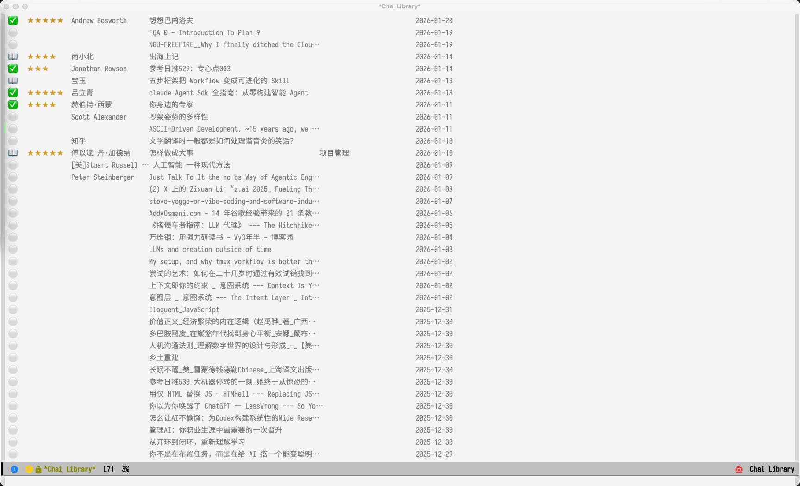
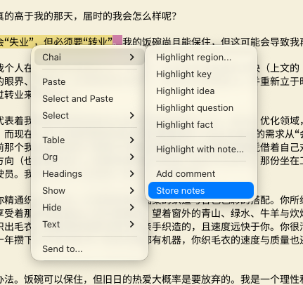
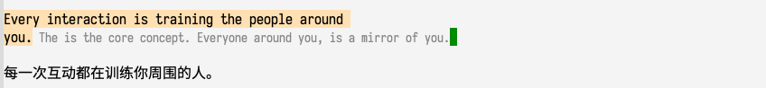

#+TITLE: Chai (拆) - Reading, Highlights, and Export
#+AUTHOR: Yibie
#+EMAIL: yibie@outlook.com
#+DATE: 2025-01

[[file:README_cn.org][中文]]

* What is Chai (拆)

"拆" (chāi) — to dismantle, break down, and digest complex knowledge into your own understanding.

Chai is a local-first Emacs reading workflow for turning a directory of Org
books into material you can mark, retrieve, and ask questions about. Read and
annotate ordinary Org files, export notes without losing their chapter context,
search the whole Library, or ask a local model for an answer whose citations jump
back to the exact source passage.

Early versions of Chai included a heavier Refinery workflow: content was forked
into a separate workbench, rewritten there, and then saved as notes. The current
design is much lighter:

- Source files stay plain =.org= files.
- Highlights are standard Org links: =[[chai:TYPE][TEXT]]=.
- Comments are standard Org special blocks: =#+BEGIN_CHAI_COMMENT ... #+END_CHAI_COMMENT=.
- Export results are ordinary Org headlines with property drawers.
- Save, copy, and edit all work through native Org/Emacs mechanisms.

Without Chai, the files remain readable and editable as normal Org documents.
With Chai enabled, the same syntax gains semantic faces, mouse commands, note
overlays, a context panel, and one-key export.

The workflow now has five connected parts:

1. *Library* — Manage reading materials as ordinary Org files
2. *Highlights & Comments* — Mark important fragments where they appear
3. *Context-preserving Export* — Turn marks into notes under their original chapter and section headings
4. *Search* — Find passages across the whole Library and jump to the exact source position
5. *Grounded Answers* — Ask a local model and validate every citation against the passages it received

#+begin_quote
📖 Read → 🔖 Mark → 🔎 Find → 💬 Ask with citations → ✍️ Export with chapter context
#+end_quote

** What's new in v2.1.0

- *Finish a book, drop its notes anywhere.* =M-x chai-store-notes= snapshots a
  document's marks like =org-store-link= does for a link; =M-x
  chai-insert-stored-notes= puts them under any heading in your own notes,
  wrapped in a heading named after the book with a link back to it.
- *Notes keep their place in the book.* Org copy, heading buffers, preview, and
  direct save now reproduce the relevant source heading path. A note under
  “Chapter 5 → Consensus → Raft” remains under that structure instead of becoming
  an unrelated top-level item. Headings without notes are omitted.
- *Search the Library without blocking Emacs.* A side-car SQLite index rebuilds
  incrementally in a separate process, supports Chinese without an external
  segmenter, ranks marked passages higher, and opens a result at its exact source
  position. From the Library table, press =f= for every book or =F= for the book
  at point.
- *Ask with sources you can inspect.* =chai-context.el= provides numbered
  passages and citation validation; =chai-superchat.el= connects that contract to
  superchat; =chai-ask= is the standalone fallback. Optional vector recall adds
  meaning-based matches as a third fused search channel.
- *No migration trap.* Source books remain ordinary Org files. The search and
  vector indexes are disposable side-car databases; deleting them only requires
  a rebuild.

Try the smallest useful path: run =M-x chai-index-rebuild=, then
=M-x chai-search=. To verify structured export, place a Chai mark below nested
Org headings and run =M-x chai-export-preview=.

** Demo

[[file:pics/demo.gif]]

* Installation

** Dependencies

- Emacs 29.1+
- [[https://pandoc.org/][Pandoc]] (file conversion, used by import)
- Python 3.x + PyMuPDF (PDF processing, used by import)
- [[https://magit.vc/manual/transient/][transient]] (Library quick-command menu only)

*** macOS OCR Support (Optional)

#+begin_src bash
pip install pyobjc-framework-Vision Pillow
#+end_src

⚠️ OCR features are only available on macOS, using Apple Vision framework for scanned PDFs.

** Configuration

#+begin_src elisp
;; Add to load-path
(add-to-list 'load-path "~/path/to/chai/")

;; Load core modules
(require 'chai)               ;; Highlights, comments, and export
(require 'chai-library)       ;; Library management
(require 'chai-library-table) ;; Library table interface

;; Optional: Global keybindings
(global-set-key (kbd "C-c l") #'chai-library-open)
(global-set-key (kbd "C-c b") #'chai-library-open-book)
(global-set-key (kbd "C-c i") #'chai-library-import)
#+end_src

** Directories

Chai uses the following default directory structure (under =~/.emacs.d/chai/=):

#+begin_example
~/.emacs.d/chai/
├── library/          ;; Library files (managed .org files)
├── inbox/            ;; Import inbox
├── archive/          ;; Archived source files after import
├── exports/          ;; Editable export preview files
└── index.db          ;; Disposable search and optional semantic index
#+end_example

Customize via these variables:

| Variable | Description | Default |
|----------+-------------+---------|
| =chai-library-directory= | Library directory | =~/.emacs.d/chai/library/= |
| =chai-library-import-inbox= | Import inbox | =~/.emacs.d/chai/inbox/= |
| =chai-library-import-archive= | Archive directory | =~/.emacs.d/chai/archive/= |
| =chai-export-preview-directory= | Export preview directory | =~/.emacs.d/chai/exports/= |
| =chai-export-heading-file= | Optional file for the editable heading buffer | =nil= |
| =chai-stored-notes-keep-after-insertion= | Keep stored notes after inserting them | =nil= |
| =chai-index-file= | Search index database | =~/.emacs.d/chai/index.db= |
| =chai-index-preview-chars= | Passage text stored for display | =240= |
| =chai-index-chunk-max-chars= | Upper bound on a passage | =800= |
| =chai-index-progress-in-echo-area= | Report rebuild progress in the echo area | =t= |
| =chai-index-echo-interval= | Seconds between progress messages | =1.0= |
| =chai-index-auto-delay= | Idle seconds before a saved book is re-indexed | =5= |

* Library

Chai's Library is a directory of Org files. Once an =.org= file is placed in
=chai-library-directory=, it is automatically adopted when the library is opened
or refreshed. You do *not* have to run an import command first.

** Importing Files

If you start with PDF/Markdown/EPUB/HTML, use one of the import paths to convert
them into Org and move them into the library:

- =M-x chai-library-import= — Batch import all files from the inbox
- =C-u M-x chai-library-import= — Import a single specified file
- =M-x chai-library-auto-rename-all= — Rename/adopt all unmanaged =.org= files already in the library directory

*** For Web Pages: Copy as Org Mode Chrome Extension

For web articles, use the [[https://github.com/yibie/Copy-as-org-mode-chrome][Copy as Org Mode]] browser extension. It supports
[[https://github.com/alexkreidler/Defuddle][defuddle]], so copied pages include author, title, and other metadata already
formatted as Org. Paste the result directly into =chai-library-directory=; Chai
will adopt it with the metadata intact, no manual filename editing required.

From the terminal:

#+begin_src bash
# Batch import
python convert-to-org.py \
  --temp ~/.emacs.d/chai/inbox/ \
  --reference ~/.emacs.d/chai/library/ \
  --archive ~/.emacs.d/chai/archive/

# Single file import
python convert-to-org.py \
  --file ~/Downloads/paper.pdf \
  --reference ~/.emacs.d/chai/library/
#+end_src

*** Supported Formats

- PDF (supports scanned PDF OCR, macOS only)
- Markdown
- EPUB
- HTML

** Opening a Book Directly

Run =M-x chai-library-open-book= to show the Library's filenames directly in
the minibuffer. Type to filter, press =RET=, and Chai opens the selected Org
file without opening the Library table first. The command only lists =.org=
filenames; it does not parse book contents or metadata before selection.

** File Naming Convention

Imported files use structured naming:

#+begin_example
ID__Author__Title==keyword1_keyword2--status-rating.org
#+end_example

Delimiter meanings:
- =__= — Metadata separator (ID, author, title)
- ==== — Keyword separator
- =--= — Status and rating

You can also run the batch rename script from the terminal:

#+begin_src bash
emacs --batch -L . -l chai-library.el -l chai-library-batch-rename.el \
      --eval '(chai-library-batch-rename)'
#+end_src

** Using the Library

Run =M-x chai-library-open= to open the library interface (full-frame):

| Key | Function |
|-----+----------|
| =?= | Open the transient quick-command menu |
| =RET= | Open selected book/document |
| =s= | Set reading status (unread/reading/done/archived) |
| =r= / =0-5= | Set rating (0-5 stars) |
| =k= | Set keywords (comma-separated, stored in filename) |
| =a= | Manually rename/adopt selected file |
| =d= | Delete file (requires confirmation) |
| =/= | Filter by title/author/keywords |
| =c= | Clear filter |
| =S= | Toggle sort order |
| =g= | Refresh list |

The =?= key opens a *transient* quick-command menu — it is a shortcut palette, not a
persistent operating panel. Use it to run a single command and return to the table.

Refresh (=g=) preserves the current book/selection position when possible.

Evil is automatically disabled in =chai-library-mode= so that the plain keymap above
is not shadowed by Evil bindings.

Customize Library keys with =chai-library-keybindings=. If you change it after
loading Chai, run =M-x chai-library-apply-keybindings=.

#+begin_src elisp
(setq chai-library-keybindings
      '(("RET" . chai-library-open-book-at-point)
        ("R"   . chai-library-refresh)
        ("K"   . chai-library-set-keywords)))
(chai-library-apply-keybindings)
#+end_src

* Highlights and Comments

** Storage Syntax

While reading an Org file, Chai chooses the highlight storage form from whether
the selected region contains a literal newline:

- Single-line text: =[[chai:TYPE][TEXT]]=; with an annotation use
  =[[chai:TYPE:NOTE][TEXT]]=
- Multiline text: =#+BEGIN_CHAI :type TYPE= ... =#+END_CHAI=, preserving the
  original line and paragraph structure
- Free-standing comment: =#+BEGIN_CHAI_COMMENT= ... =#+END_CHAI_COMMENT=

Single-line text keeps the Org link as its persistent marker and is displayed
with the configured Chai face. Multiline selections use a special block whose
contents use Org's `org-quote` style; the block header keeps `:type TYPE` as the
visible semantic marker. Both forms are collected through the same Chai
highlight model.

** Commands

| Command | Function |
|---------+----------|
| =M-x chai-highlight-region= | Highlight selected region |
| =M-x chai-highlight-annotate= | Highlight selected region with note |
| =M-x chai-remove-highlight= | Remove highlight at point |
| =M-x chai-add-comment= | Prompt for a free-standing comment |
| =M-x chai-insert-comment= | Insert a =#+BEGIN_CHAI_COMMENT= block |
| =M-x chai-export-highlights-copy= | Copy highlights and comments as plain text |
| =M-x chai-export-highlights-copy-org= | Copy highlights and comments as Org markup |
| =M-x chai-export-heading= | Open an editable temporary heading buffer |
| =M-x chai-export-preview= | Open editable Org preview buffer |
| =M-x chai-export-preview-save= | Save Org export directly to the preview file |
| =M-x chai-store-notes= | Store the document's marks to insert elsewhere |
| =M-x chai-insert-stored-notes= | Insert stored marks under the heading at point |
| =M-x chai-context-panel-toggle= | Toggle highlight overview panel |
| =M-x chai-refresh-annotations= | Refresh annotation overlays |

** Highlighting System

Chai provides 12 semantic highlight types. Each type is rendered with a face, so
highlights are visible directly in the buffer. Faces work in both light and dark
themes, and you can customize them or add your own types.

Right-click anywhere in a Chai-enabled Org buffer and open the single *Chai*
submenu; Chai adds nothing else to the context menu. From top to bottom it
holds:

- On a chai link: *Change type*, *Edit annotation*, *Remove highlight*,
  *Copy text*
- *Highlight region...* — choose any highlight type for the active region
- *Highlight TYPE* — quick entries generated from =chai-highlight-types=
- *Highlight with note...* — highlight the region and attach a note (annotation)
- *Add comment* — wrap the region in a =#+BEGIN_CHAI_COMMENT= block, or insert
  an empty comment block at point when no region is active
- *Store notes* / *Insert stored notes* — see [[*Store and Insert Notes][Store and Insert Notes]]

*** Built-in Types

- 🔴 *important* — Important viewpoint
- 🟢 *idea* — Inspiration/thought
- 🟠 *question* — Question
- 🟡 *critical* — Critical content
- 💛 *key* — Central idea/main point (yellow)
- 🔴 *core* — Definition/core concept (red/orange)
- 🟢 *detail* — Data/key details (green, underline)
- 🔵 *example* — Cases/supporting evidence (blue, underline)
- 🟣 *hard* — Difficulty/logical turn (purple, wavy)
- ⬜ *block* — Complete viewpoint paragraph (grey, border)
- 🟪 *view* — Author's opinion/personal insight (purple)
- ⚫ *outdated* — Excluded/outdated info (strikethrough)

Customize highlight types:

#+begin_src elisp
(setq chai-highlight-types
      '(("important" . chai-highlight-important)
        ("idea" . chai-highlight-idea)
        ("key" . chai-highlight-key)
        ;; ... add custom types
        ("todo" . hl-line)))
#+end_src

The built-in light `key` face uses a more visible soft amber background so it
does not disappear into a light editing background. Customize the face or
replace its entry in `chai-highlight-types` when you prefer another palette.

** Context Panel

Press =C-c p= (when bound) to toggle a side window showing all highlights
grouped by type. The current highlight's group is highlighted for easy
navigation.

** Free-Standing Comments

Use =#+BEGIN_CHAI_COMMENT= blocks for notes that are not attached to a specific
highlighted fragment:

#+begin_example
#+BEGIN_CHAI_COMMENT
This is my own thought about the section above.
#+END_CHAI_COMMENT
#+end_example

- =M-x chai-add-comment= prompts for comment text and inserts a complete block.
- =M-x chai-insert-comment= inserts an empty block, or wraps the active region.
- Comments are collected and exported together with highlights in source order.

* Search

Chai can search every book in the Library at once and jump straight to the
passage it found. The index is a side-car SQLite database built from your Org
files; it never modifies them, and deleting it costs nothing but a rebuild.

The search commands need no extra configuration: they are autoloaded by =chai=,
so they appear in =M-x= as soon as Chai is loaded and pull in the search code
the first time you run one.

** Building the Index

| Command | Function |
|---------+----------|
| =M-x chai-index-rebuild= | Bring the index up to date (only changed books are re-read) |
| =C-u M-x chai-index-rebuild= | Force a full rebuild |
| =M-x chai-index-update-file= | Re-index just the book in the current buffer |
| =M-x chai-index-status= | Report how many books and passages are indexed |
| =M-x chai-index-reset= | Delete the index entirely |
| =M-x chai-index-stop= | Stop a rebuild that is running |
| =M-x chai-index-auto-mode= | Re-index a book shortly after you save it |

Run interactively, a rebuild happens in a **separate Emacs process**, so your
editing session is never blocked — not even briefly. Progress appears in the
echo area and in the mode line, and you can search the index while it is still
being built: every
book is committed as it finishes. Stopping is safe for the same reason; the
next rebuild resumes from where it stopped.

Rebuilds are incremental. A book whose content has not changed is skipped by
content hash, so only the first pass is expensive. With =chai-index-auto-mode=
on, a book you save is re-indexed a few idle seconds later, so the index keeps
up with your reading without you asking it to.

From the Library table, =f= searches every book and =F= searches only the book
at point.

Measured on a real library of 2788 books totalling 790 MB of Org text: the
first full pass takes about three minutes, a later pass with nothing changed
about 15 seconds, and the index occupies roughly 1.3 GB. Searching while that
rebuild runs stays at about a millisecond. The index lives in a single file you
can delete at any time.

** Searching

#+begin_src elisp
M-x chai-search             ;; search every book
M-x chai-search-highlights  ;; search only passages you have annotated
#+end_src

In the =*Chai Search*= buffer:

| Key | Action |
|-----+--------|
| =RET= / =mouse-1= | Open the passage in this window |
| =o= | Open the passage in another window |
| =n= / =p= | Next / previous hit |
| =g= | Run the last query again |
| =q= | Close the results |

Each hit carries the exact buffer position of the passage, so opening it lands
on the text rather than at the top of the file. The index stores only the first
=chai-index-preview-chars= of a passage — that is what the results buffer shows,
and storing every passage in full was over half the index. =chai-search-passage-text=
reads a passage back in full from its source file, which also means it reflects
the file as it reads now rather than when it was indexed. Hits are labelled with the full
path of headings enclosing them — =第五章 分布式系统 › 第三节 共识协议 › Raft= —
so you can tell where in a long book the passage sits. Only the heading directly
above a passage is searchable: indexing the whole path would make any query
matching a chapter title return every passage in that chapter.

** Chinese Search

Chai indexes Chinese as overlapping two-character units rather than whole runs,
so a query for =共识算法= reaches a book that only ever wrote =分布式共识=. No
external segmenter is needed. English and Chinese can be mixed freely in the
same query and the same book.

** Annotations Rank Higher

A passage you have highlighted or commented on is recalled twice: once as
ordinary text, and once as annotated text. The two rankings are combined with
Reciprocal Rank Fusion, so the passages you judged important surface above
equally relevant passages you never marked.

** Filtering

=chai-search= accepts an optional plist that narrows the search:

#+begin_src elisp
(chai-search "共识" '(:status done))           ;; only books marked done
(chai-search "共识" '(:keyword "distsys"))     ;; only books with this keyword
(chai-search "共识" '(:highlighted t))         ;; only annotated passages
(chai-search "共识" '(:type "important"))      ;; only IMPORTANT highlights
#+end_src

* Asking

Chai finds the passages; something else writes the answer. Both paths below
share the same citation contract: passages are numbered, the markers a model
writes are validated against what it was actually given, and a valid marker
jumps to the exact place in the book.

** With a chat client (recommended)

If you already run a chat client in Emacs, let it do the answering and let Chai
do the finding. =chai-superchat.el= wires Chai into
[[https://github.com/yibie/superchat][superchat]]: every turn is searched against your books, what is found is
attached to the prompt as numbered passages, and the citations in the reply
become jumps into the source.

Nothing to configure: loading =chai= arranges for the integration to come up
with superchat, and it stays unloaded until superchat is there.
=M-x chai-superchat-mode= toggles it.

*** When does superchat read the Library?

Never, until you say so. superchat is a general chat client — a question about
a git diff should not get chapters of a book stapled to it — so there are two
deliberate ways in:

#+begin_src text
/chai 共识算法是什么           ;; this question only
#+end_src

#+begin_src elisp
M-x chai-superchat-cowork      ;; this conversation, from here on
C-u M-x chai-superchat-cowork  ;; stop reading it here
#+end_src

=/chai= consults the books for that turn and leaves the conversation otherwise
as it was; the answer stays in the conversation, so you can follow up on it
like any other. =chai-superchat-cowork= marks the whole conversation, and the
mark follows the conversation rather than whichever buffer you are in.

Set =chai-superchat-scope= to =always= if you use superchat mostly for reading
and want every turn searched. To ask without superchat at all, use =chai-ask=.

The division is by what each side knows. Choosing a model, streaming, sessions,
memory and tools are superchat's, and it does all of them better than a reading
tool would — =@claude-sonnet= mid-conversation, several providers, MCP tools.
Knowing that =[3]= means a particular character position in a particular Org
file, under a particular chapter, is Chai's, and superchat has no way to know
it. The integration is thin on purpose: passages go one way, citations the
other.

The same seam works for any client. =chai-context-for= returns numbered
passages for a question, =chai-context-render= formats them, =chai-context-citations=
validates the markers a model wrote, and =chai-context-linkify= turns them into
jumps. Wiring a different client is a handful of lines.

** Standalone

=chai-ask= answers a question without any chat client, talking to one local
server over curl and rendering the answer in a buffer of its own.

#+begin_src elisp
M-x chai-ask        ;; ask a question
M-x chai-ask-again  ;; ask the last one again
#+end_src

In the =*Chai Answer*= buffer, =RET= on a citation opens that passage; =n= and
=p= move between citations.

Answers stream in as they are written. The model is asked not to reason at
length first: a reasoning model spends the whole answer budget thinking before
writing a word, and the passages are already in front of it.

Three rules keep an answer honest:

- **Citations are validated, not trusted.** The model is handed passages
  numbered =[1]..[N]=; any marker outside that range is dropped rather than
  shown. A model that cites =[9]= when given five passages invented the source.
- **The context is budgeted before it is sent.** Overflowing the model's window
  does not fail loudly — the runtime drops tokens from the front, which is
  where the instructions live. Passages are added while they fit and the
  surplus is left out.
- **Nothing retrieved means no answer.** Chai says so rather than letting the
  model answer from its own memory.

Requires a local model server (Ollama by default) and =curl=.

| Variable | Description | Default |
|----------+-------------+---------|
| =chai-ask-model= | Model that writes answers | =qwen3.5:9b= |
| =chai-ask-endpoint= | Server address | =http://localhost:11434= |
| =chai-ask-passages= | Greatest number of passages used | =8= |
| =chai-ask-context-tokens= | Token budget for those passages | =4000= |
| =chai-ask-think= | Let the model reason at length first | =nil= |

* Semantic Recall (optional)

Lexical search finds passages that contain your words. Semantic recall also
finds passages that mean what you asked, in words you did not use — asking why
people procrastinate reaches a chapter on the subject that never repeats the
question's phrasing.

It is entirely optional: without it Chai searches exactly as it does now.

** Setting it up

1. Install [[https://github.com/asg017/sqlite-vec][sqlite-vec]] and put the loadable extension at
   =~/.emacs.d/chai/vec0.dylib= (=.so= on Linux, =.dll= on Windows), or set
   =chai-vector-extension=. The file must keep the name =vec0=: Emacs loads
   SQLite extensions only from a fixed allowlist of names.
2. Pull the embedding model: =ollama pull bge-m3=.
3. Run =M-x chai-vector-build=.

#+begin_src elisp
M-x chai-vector-build   ;; embed the Library's sections (long; resumable)
M-x chai-vector-status  ;; how much of the Library is embedded
M-x chai-vector-stop    ;; stop an embedding run
M-x chai-search-semantic ;; one search using semantic recall as well
#+end_src

Like indexing, the build runs in a separate Emacs and can be stopped and
resumed. Measured on a library of 2788 books: about four hours once, and
roughly 90 MB added to the index.

** What it embeds, and why

Sections, not passages. Embedding every passage costs thirteen hours and adds
0.6 s to every query, because the vector search scans linearly; embedding
sections costs four hours and a fraction of that. Nothing is lost: the searches
semantic recall wins are chapter-topic matches, which is what a section is.

Vectors are stored quantised to =int8=, which keeps 98-100% of the ranking at a
quarter of the size.

** Where it is used

=chai-ask= uses semantic recall whenever it is available, because the extra
tenth of a second disappears next to the model's own latency. Ordinary
=chai-search= does not, so it stays at about a millisecond; =chai-search-semantic=
turns it on for one search, and =chai-search-semantic= as a variable turns it on
for good.

The semantic channel only ever *adds* candidates. A vector search returns its
nearest neighbours whatever you ask, so it can never report that nothing
matched — that judgement stays with the lexical channel.

* Store and Insert Notes

Like =org-store-link= for a whole reading session: when you finish a document,
run =M-x chai-store-notes= (or right-click → /Chai → Store notes/). It snapshots
the highlights and comments without touching the kill ring. Scope follows the
copy commands: active region, =C-u= for the current subtree, otherwise the
whole buffer. Storing the whole buffer again replaces the earlier snapshot of
the same document.

Then go to any Org note and run =M-x chai-insert-stored-notes= (or right-click
→ /Chai → Insert stored notes/ at the spot). With one stored snapshot it is
inserted immediately; with several you pick one, newest first. The notes land
as the last child of the heading at point (with =C-u=, as a sibling after
its subtree; before the first heading, as a top-level heading), wrapped in a heading named after the document's
=#+TITLE= (or the title in its Library file name) with a link back to the source:

#+begin_example
* My notes on attention
my own thoughts...
** The Attention Economy
:PROPERTIES:
:SOURCE: [[chai:20240101T120000][The Attention Economy]]
:END:
*** Chapter 1
**** [KEY] highlighted text
:PROPERTIES:
:SOURCE: [[chai:20240101T120000::42][L42]]
:END:
#+end_example

The snapshot is removed once inserted; set
=chai-stored-notes-keep-after-insertion= to keep it for further insertions.
Stored notes live only in the current Emacs session.

* Export Format

Chai distinguishes between *storage syntax* (what you type while reading) and
*export syntax* (what is copied to the kill ring or shown in the preview
buffer).

=M-x chai-export-highlights-copy-org= copies highlights and comments as
source-ordered plain Org entries. A highlight heading starts with a visible
=*[TYPE]= prefix, a free-standing comment starts with =*[COMMENT]=, and each
entry owns exactly one =:SOURCE:= property in its drawer. No TODO keywords,
quote blocks, annotation blocks, or document-level export header are added.

Annotations are emitted as plain text below the drawer. Multiline source text
is kept as plain body text below the heading; single-line source text stays in
the heading itself.

=M-x chai-export-heading= opens the same entries in an editable
=*Chai Heading Export*= buffer. By default it remains an unsaved temporary
buffer, so you can reorganize it and copy it into another note. Set
=chai-export-heading-file= to a fixed =.org= path when you want =C-x C-s= to
save the organized result there without choosing a file each time. The command
only associates the buffer with that path; it does not write the file until you save.

=M-x chai-export-preview= opens the same export in an editable =*Chai Export
Preview*= buffer. The buffer is associated with
=~/.emacs.d/chai/exports/<source-base>_chai.org= (customize via
=chai-export-preview-directory=) so you can edit it and press =C-x C-s= to save
normally. No file is written until you save.

=M-x chai-export-preview-save= writes the same export directly to that file.

#+begin_example
* [IMPORTANT] highlighted text
:PROPERTIES:
:SOURCE: [[file:/path/to/source.org::25][L25]]
:END:
#+end_example

Annotated highlights keep the note as plain text under the drawer:

#+begin_example
* [IDEA] highlighted text
:PROPERTIES:
:SOURCE: [[file:/path/to/source.org::25][L25]]
:END:
annotation text
#+end_example

Free-standing comments export as =*[COMMENT]= headlines:

#+begin_example
* [COMMENT] free-standing comment text
:PROPERTIES:
:SOURCE: [[file:/path/to/source.org::120][L120]]
:END:
#+end_example

The =L25= link jumps to the source line in the original file.

* Commands Reference

** Library Commands

| Command | Function |
|---------+----------|
| =M-x chai-library-open= | Open the Library table |
| =M-x chai-library-open-book= | Select a book in the minibuffer and open it |
| =M-x chai-library-import= | Import files from inbox (or a single file with prefix) |
| =M-x chai-library-auto-rename-all= | Rename/adopt all unmanaged =.org= files in the library directory |
| =M-x chai-library-refresh= | Refresh the Library table |
| =M-x chai-library-set-status= | Set reading status for book at point |
| =M-x chai-library-set-rating= / =0-5= | Set rating for book at point |
| =M-x chai-library-set-keywords= | Set keywords for book at point |
| =M-x chai-library-delete= | Delete book at point |
| =M-x chai-library-apply-keybindings= | Re-apply custom =chai-library-keybindings= |

** Reading / Highlight Commands

| Command | Function |
|---------+----------|
| =M-x chai-highlight-region= | Highlight selected region |
| =M-x chai-highlight-annotate= | Highlight selected region with note |
| =M-x chai-remove-highlight= | Remove highlight at point |
| =M-x chai-add-comment= | Prompt for and insert a free-standing comment |
| =M-x chai-insert-comment= | Insert a =#+BEGIN_CHAI_COMMENT= block |
| =M-x chai-export-highlights-copy= | Copy marks as plain text |
| =M-x chai-export-highlights-copy-org= | Copy marks as Org markup |
| =M-x chai-export-preview= | Open editable Org preview buffer |
| =M-x chai-export-preview-save= | Save Org export directly to preview file |
| =M-x chai-store-notes= | Store marks to insert elsewhere |
| =M-x chai-insert-stored-notes= | Insert stored marks at point |
| =M-x chai-context-panel-toggle= | Toggle highlight overview panel |
| =M-x chai-refresh-annotations= | Refresh annotation overlays |

** Search Commands

| Command | Description |
|---------+-------------|
| =chai-index-rebuild= | Update the search index from the Library |
| =chai-index-update-file= | Re-index the current book |
| =chai-index-status= | Show index size and last update |
| =chai-index-reset= | Delete the index |
| =chai-index-stop= | Stop a running rebuild |
| =chai-search= | Search every book |
| =chai-search-highlights= | Search only annotated passages |
| =chai-search-semantic= | Search with semantic recall as well |
| =chai-ask= | Answer a question with citations |
| =chai-ask-again= | Ask the last question again |
| =chai-superchat-mode= | Wire Chai into superchat |
| =chai-superchat-cowork= | Make this conversation read the Library |
| =chai-vector-build= | Embed the Library for semantic recall |
| =chai-vector-status= | Show how much is embedded |
| =chai-vector-stop= | Stop an embedding run |

* Quick Start

1. *Put materials in the library* — Drop =.org= files into
   =chai-library-directory=, or import PDF/Markdown/EPUB/HTML with
   =M-x chai-library-import=.
2. *Open a book* — run =M-x chai-library-open-book= to select one in the minibuffer,
   or run =M-x chai-library-open= and press =RET= on the current entry.
3. *Highlight* — Select text and =M-x chai-highlight-region= or
   =M-x chai-highlight-annotate=.
4. *Export* — =M-x chai-store-notes= when you finish reading, then
   =M-x chai-insert-stored-notes= in your own note; or
   =M-x chai-export-preview= to edit and save the export directly.

* Integration with Other Tools

Chai is designed to work alongside existing note-taking systems:

- *Org-roam* — Paste exported highlights into Org-roam notes
- *Denote* — Chai uses Denote-compatible timestamp IDs
- *Citar/Org-cite* — Add =#+BIBLIOGRAPHY= references in book files

* Contributing

Issues and PRs welcome!

- Code style: Follow standard Emacs Lisp conventions
- Tests: Add tests in =test/= directory for new features
- Documentation: Update this README to reflect changes

* License

GPL-3.0-or-later

* Author

Yibie <yibie@outlook.com>

* Acknowledgments

- Design philosophy inspired by Zettelkasten and Progressive Summarization

* Changelog

** Unreleased

- All user-facing messages and prompts are now in English, including the
  =chai-ask= answer buffer, citation labels, and the default model instructions
  (answers still follow the language of the question).

** v2.1.0 (2026-09)

- New =chai-store-notes= / =chai-insert-stored-notes=: store a document's
  marks when you finish reading and insert them under any Org heading, without
  going through the kill ring. Both are also in the right-click menu.
- The right-click menu now groups every Chai action under one *Chai* submenu.
- Org copy, heading buffers, preview, and direct save preserve the relevant
  source heading hierarchy; range and subtree export restore ancestors without
  including unrelated notes
- Search is available directly from the Library table: =f= searches all books
  and =F= limits the query to the book at point
- =chai-index-auto-mode= incrementally refreshes a saved book after an idle delay
- Loading =chai= now reliably activates the optional superchat integration when
  superchat becomes available; =/chai= and conversation-level cowork mode remain
  explicit opt-ins

- Added =chai-ask=: streamed answers grounded in the Library, with validated
  citations that jump back to the passage they came from
- Added =chai-context.el=: numbered passages and validated citations, the seam
  any chat client can use, and =chai-superchat.el= wiring it into superchat
- Added optional semantic recall (=chai-vector-build=), a third fused channel
  finding passages by meaning rather than wording
- Both run against a local model server; nothing leaves the machine

- Added cross-library search: =chai-search= and =chai-search-highlights= find
  passages across every book and jump to the exact position
- Added the =chai-index.el= side-car SQLite index with incremental,
  content-hash based rebuilds
- Chinese search works without an external segmenter, via overlapping
  two-character indexing
- Rebuilds run in a separate Emacs process and can be stopped and resumed
- Hits show the full heading path of the passage
- Highlighted and commented passages rank above unannotated ones through
  Reciprocal Rank Fusion over both recall channels

** v2.0.0 (2026-06)

- *Workflow redesign*: Chai no longer forks content into a separate workbench.
  You now read directly in ordinary Org files, mark text with standard Org links
  (=[[chai:TYPE][TEXT]]=), add notes with standard Org blocks
  (=#+BEGIN_CHAI_COMMENT=), and export collected marks only when needed.
- *Refinery removed*: The intermediate Refinery workbench and note-saving flow
  have been removed. Chai now focuses on Library management and highlight export.
- *Plain heading export*: Org export now uses source-ordered =*[TYPE]= /
  =*[COMMENT]= headings with one =:SOURCE:= drawer per entry. Notes are plain
  text; TODO keywords, quote blocks, and document-level export headers are not
  added.
- *Export preview*: New =M-x chai-export-preview= opens an editable preview
  buffer, and =M-x chai-export-preview-save= writes directly to the preview file.
- *Temporary note buffer*: =M-x chai-export-heading= opens the same plain
  headings in an unsaved editable buffer; configure =chai-export-heading-file=
  to save it through the normal =C-x C-s= command without repeated file prompts.
- *Highlight contrast*: dark-theme Chai faces now set an explicit light
  foreground so highlights do not inherit an unreadable or black text color.
- *Export output*: The generated buffer/file contains only the collected Org
  entries, so it can be edited or saved as an ordinary note without Chai-owned
  document metadata.
- *Library transient menu*: =?= opens a quick transient command menu in the
  Library table.
- *tp.el removed*: Library table no longer depends on tp.el; status/rating
  changes refresh the standard tabulated-list display.
- *Batch rename retained*: Duplicate auto-rename logic merged into a single
  core function used by both interactive import and the batch script.
- *README rewrite*: README.org and README_cn.org rewritten around the current
  Library + Highlight/Comment + Export Preview workflow.
- *Browser extension*: README now recommends [[https://github.com/yibie/Copy-as-org-mode-chrome][Copy as Org Mode]] for importing web
  pages with metadata.

** v1.1.0 (2026-02)

- *Library*: Add =k= keybinding to set keywords for a book; keywords are
  encoded in the filename (===kw1_kw2= section) and searchable via =/
- *Library*: Fix keywords column not refreshing after changes
- *Library*: Open in full-frame window (=delete-other-windows=)
- *Annotations*: Automatically render note overlays in any Org buffer
  containing chai links, without requiring =chai-mode= to be active

** v1.0.0 (2025-01)

- Initial release
- Library knowledge base management
- Highlighting and linking system
- Context Panel for structured annotation review
- macOS OCR support
