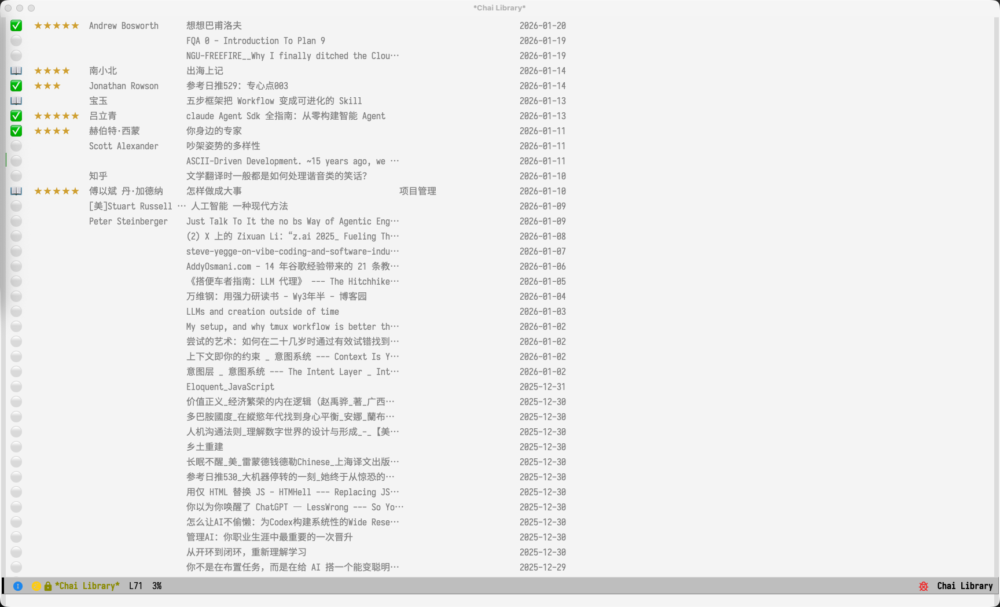
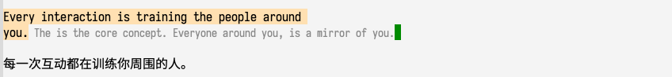

#+TITLE: Chai (拆) - 阅读、高亮与导出
#+AUTHOR: Yibie
#+EMAIL: yibie@outlook.com
#+DATE: 2025-01

* Chai (拆)

"拆"——将复杂的知识拆解、消化、重组为自己的理解。

Chai 是一个轻量级的 Emacs 阅读工作流。它不会把原文搬进另一个笔记系统加工，而是让你在
普通的 Org 文件里直接阅读，并在原地留下轻量标记；Chai 再为这些标记提供颜色显示、鼠标
操作、注释 overlay、上下文导航和结构化导出。

早期 Chai 包含一个更重的 Refinery 流程：把原文内容分叉到独立工作台，在那里改写、压缩、
再保存为笔记。现在的设计更轻：

- 源文件仍然是普通的 =.org= 文件。
- 高亮是标准 Org link：=[[chai:TYPE][TEXT]]=。
- 批注是标准 Org special block：=#+BEGIN_CHAI_COMMENT ... #+END_CHAI_COMMENT=。
- 导出结果是普通 Org headline 加 properties drawer。
- 保存、复制、编辑都走 Org/Emacs 原生机制。

即使不加载 Chai，这些文件依然是可读、可编辑的普通 Org 文档；加载 Chai 后，同一套语法会
获得语义化 face、鼠标命令、注释 overlay、上下文面板和一键导出。

整个工作流分为三个部分：

1. *Library（知识库）* —— 以 Org 文件管理阅读材料
2. *高亮与评论* —— 在阅读过程中标记重要片段并写下想法
3. *导出与预览* —— 将标记导出或预览为 Org 笔记

#+begin_quote
📖 在 Library 中阅读 → 🔖 高亮 / 评论 → ✍️ 导出 / 预览到自己的笔记
#+end_quote

** 演示

[[file:pics/demo.gif]]

* 安装

** 依赖

- Emacs 29.1+
- [[https://pandoc.org/][Pandoc]]（文件转换，导入时使用）
- Python 3.x + PyMuPDF（PDF 处理，导入时使用）
- [[https://magit.vc/manual/transient/][transient]]（仅用于 Library 快捷命令菜单）

*** macOS OCR 支持（可选）

#+begin_src bash
pip install pyobjc-framework-Vision Pillow
#+end_src

⚠️ OCR 功能仅在 macOS 上可用，使用 Apple Vision 框架识别扫描版 PDF。

** 配置

#+begin_src elisp
;; 添加到 load-path
(add-to-list 'load-path "~/path/to/chai/")

;; 加载核心模块
(require 'chai)               ;; 高亮、评论与导出
(require 'chai-library)       ;; 知识库管理
(require 'chai-library-table) ;; 知识库表格界面

;; 可选：全局快捷键
(global-set-key (kbd "C-c l") #'chai-library-open)
#+end_src

** 目录结构

Chai 默认使用以下目录结构（均在 =~/.emacs.d/chai/= 下）：

#+begin_example
~/.emacs.d/chai/
├── library/          ;; 知识库文件（已接管的 .org 文件）
├── inbox/            ;; 待导入文件
├── archive/          ;; 导入后原文件归档
└── exports/          ;; 可编辑的导出预览文件
#+end_example

可通过以下变量自定义：

| 变量 | 说明 | 默认值 |
|------+------+--------|
| =chai-library-directory= | 知识库目录 | =~/.emacs.d/chai/library/= |
| =chai-library-import-inbox= | 导入收件箱 | =~/.emacs.d/chai/inbox/= |
| =chai-library-import-archive= | 归档目录 | =~/.emacs.d/chai/archive/= |
| =chai-export-preview-directory= | 导出预览目录 | =~/.emacs.d/chai/exports/= |

* Library（知识库）

Chai 的 Library 是一个 Org 文件目录。只要将 =.org= 文件放入
=chai-library-directory=，打开或刷新 Library 时就会自动接管。你*不需要*先运行导入命令。

** 导入文件

如果你从 PDF/Markdown/EPUB/HTML 开始，可以用以下方式将其转换为 Org 并放入知识库：

- =M-x chai-library-import= —— 批量导入 inbox 目录中的所有文件
- =C-u M-x chai-library-import= —— 导入单个指定文件
- =M-x chai-library-auto-rename-all= —— 重命名/接管知识库目录中所有未规范命名的 =.org= 文件

*** 网页导入：Copy as Org Mode 浏览器插件

对于网页文章，建议使用 [[https://github.com/yibie/Copy-as-org-mode-chrome][Copy as Org Mode]] 浏览器插件。它已支持
[[https://github.com/alexkreidler/Defuddle][defuddle]]，复制出的内容会包含作者、标题等元信息，并且已经是 Org 格式。
直接将其粘贴到 =chai-library-directory=，Chai 会自动接管并保持元信息完整，
无需手动修改文件名。

通过命令行：

#+begin_src bash
# 批量导入
python convert-to-org.py \
  --temp ~/.emacs.d/chai/inbox/ \
  --reference ~/.emacs.d/chai/library/ \
  --archive ~/.emacs.d/chai/archive/

# 单文件导入
python convert-to-org.py \
  --file ~/Downloads/paper.pdf \
  --reference ~/.emacs.d/chai/library/
#+end_src

*** 支持格式

- PDF（支持扫描版 OCR，仅限 macOS）
- Markdown
- EPUB
- HTML

** 文件名格式

导入后的文件使用结构化命名：

#+begin_example
ID__Author__Title==keyword1_keyword2--status-rating.org
#+end_example

分隔符含义：
- =__= —— 元数据分隔（ID、作者、标题）
- ==== —— 关键词分隔
- =--= —— 状态和评分

也可以从终端运行批量重命名脚本：

#+begin_src bash
emacs --batch -L . -l chai-library.el -l chai-library-batch-rename.el \
      --eval '(chai-library-batch-rename)'
#+end_src

** 使用 Library

运行 =M-x chai-library-open= 打开知识库界面（全屏显示）：

| 按键 | 功能 |
|------+------|
| =?= | 打开 transient 快捷命令菜单 |
| =RET= | 打开选中的书籍/文档 |
| =s= | 设置阅读状态（unread/reading/done/archived） |
| =r= / =0-5= | 设置评分（0-5 星） |
| =k= | 设置关键词（逗号分隔，编码到文件名中） |
| =a= | 手动重命名/接管选中文件 |
| =d= | 删除文件（需确认） |
| =/= | 按标题/作者/关键词过滤 |
| =c= | 清除过滤 |
| =S= | 切换排序方式 |
| =g= | 刷新列表 |

=?= 打开的是 *transient* 快捷命令菜单——它是一个快捷命令面板，不是常驻操作面板。
选择一个命令执行后就会回到表格。

按 =g= 刷新时会尽量保持当前书籍/选中位置。

=chai-library-mode= 下会自动禁用 Evil，避免上述按键被 Evil 覆盖。

可以通过 =chai-library-keybindings= 自定义 Library 按键。若在加载 Chai 后修改，
再运行 =M-x chai-library-apply-keybindings= 使其生效。

#+begin_src elisp
(setq chai-library-keybindings
      '(("RET" . chai-library-open-book-at-point)
        ("R"   . chai-library-refresh)
        ("K"   . chai-library-set-keywords)))
(chai-library-apply-keybindings)
#+end_src

* 高亮与评论

** 存储语法

在阅读 Org 文件时，使用 Chai 链接和自由评论块来标记片段：

- 高亮文本：=[[chai:TYPE][TEXT]]=
- 带注释的高亮：=[[chai:TYPE:NOTE][TEXT]]=
- 自由评论块：=#+BEGIN_CHAI_COMMENT= ... =#+END_CHAI_COMMENT=

** 命令

| 命令 | 功能 |
|------+------|
| =M-x chai-highlight-region= | 高亮选中区域 |
| =M-x chai-highlight-annotate= | 高亮并添加注释 |
| =M-x chai-remove-highlight= | 移除光标处高亮 |
| =M-x chai-add-comment= | 输入并插入一条自由评论 |
| =M-x chai-insert-comment= | 插入 =#+BEGIN_CHAI_COMMENT= 块 |
| =M-x chai-export-highlights-copy= | 以纯文本复制高亮与评论 |
| =M-x chai-export-highlights-copy-org= | 以 Org 格式复制高亮与评论 |
| =M-x chai-export-preview= | 打开可编辑的 Org 预览 buffer |
| =M-x chai-export-preview-save= | 直接保存 Org 导出到预览文件 |
| =M-x chai-context-panel-toggle= | 切换高亮概览面板 |
| =M-x chai-refresh-annotations= | 刷新注释 overlay |

** 高亮系统

Chai 提供 12 种语义化高亮类型。每种类型都对应一个 face，因此高亮会直接显示在
buffer 中。face 同时适配浅色/深色主题，你也可以自定义或新增类型。

在 chai 链接上右键，可以修改类型、编辑注释、移除高亮、复制高亮文本。选中区域后
右键，可以快速将其高亮为 =important=、=idea=、=question=、=key= 或其他类型。

*** 内置类型

- 🔴 *important* —— 重要观点
- 🟢 *idea* —— 灵感/想法
- 🟠 *question* —— 疑问
- 🟡 *critical* —— 关键内容
- 💛 *key* —— 中心思想/主旨句（黄色高亮）
- 🔴 *core* —— 定义/核心考点（红/橙色高亮）
- 🟢 *detail* —— 数据/关键细节（绿色下划线）
- 🔵 *example* —— 案例/辅助证据（蓝色下划线）
- 🟣 *hard* —— 难点/逻辑转折（紫色波浪线）
- ⬜ *block* —— 完整观点段落（灰色边框）
- 🟪 *view* —— 作者观点/个人心得（紫色）
- ⚫ *outdated* —— 排除/过时信息（删除线）

自定义高亮类型：

#+begin_src elisp
(setq chai-highlight-types
      '(("important" . chai-highlight-important)
        ("idea" . chai-highlight-idea)
        ("key" . chai-highlight-key)
        ;; ... 添加自定义类型
        ("todo" . hl-line)))
#+end_src

** 上下文面板

按 =C-c p=（绑定后）切换侧边窗口，显示当前 buffer 所有高亮按类型分组。光标所在高亮的类型组会高亮显示，方便定位。

** 自由评论块

如果有一段想法并不依附于某个具体高亮片段，可以使用 =#+BEGIN_CHAI_COMMENT= 块：

#+begin_example
#+BEGIN_CHAI_COMMENT
这是我对上面段落的想法。
#+END_CHAI_COMMENT
#+end_example

- =M-x chai-add-comment= 会提示输入评论文本，并插入完整评论块。
- =M-x chai-insert-comment= 插入空块；若有选中区域，则将其包裹成评论块。
- 评论块会按原文顺序与高亮一起导出。

* 导出格式

Chai 区分*输入/存储语法*（阅读时直接写的标记）和*导出语法*（复制到 kill-ring 或在预览 buffer 中展示的内容）。

=M-x chai-export-highlights-copy-org= 将高亮与评论以按原文顺序排列的 Org headline 形式复制到 kill-ring。每种高亮类型会转换为大写的 TODO 状态，源文件元数据放在 =:PROPERTIES:= 抽屉里。=#+SEQ_TODO:= 行根据你的 =chai-highlight-types= 动态生成，并在末尾追加 =COMMENT= 以容纳自由批注。

文件头优先使用源 Org buffer 的 =#+TITLE=，其次回退到源文件 base 名，没有源文件时显示 "Chai Export"。

=M-x chai-export-preview= 则把同样的导出结果放进可编辑的 =*Chai Export Preview*= buffer。该 buffer 会关联到 =~/.emacs.d/chai/exports/<源文件名>_chai.org=（可通过 =chai-export-preview-directory= 自定义），你可以直接编辑并按 =C-x C-s= 正常保存。预览命令本身不会写入文件。

=M-x chai-export-preview-save= 会直接把同样的导出内容写入该预览文件。

#+begin_example
#+TITLE: 原文标题
#+SOURCE: /path/to/source.org
#+EXPORTED_AT: 2026-06-21 12:30
#+SEQ_TODO: IMPORTANT IDEA QUESTION KEY COMMENT

* IMPORTANT 原文高亮文本
:PROPERTIES:
:SOURCE: [[file:/path/to/source.org::25][L25]]
:END:
#+end_example

带注释的高亮会把注释放在 headline 下方的 =#+BEGIN_CHAI_ANNOTATION= 块内：

#+begin_example
* IDEA 原文高亮文本
:PROPERTIES:
:SOURCE: [[file:/path/to/source.org::25][L25]]
:END:
#+BEGIN_CHAI_ANNOTATION
annotation 文本
#+END_CHAI_ANNOTATION
#+end_example

自由评论导出为 =COMMENT= headline：

#+begin_example
* COMMENT 自由批注文本
:PROPERTIES:
:SOURCE: [[file:/path/to/source.org::120][L120]]
:END:
#+end_example

=L25= 链接跳转到源文件中的对应行号。

* 命令速查

** Library 命令

| 命令 | 功能 |
|------+------|
| =M-x chai-library-open= | 打开 Library 表格 |
| =M-x chai-library-import= | 从 inbox 批量导入（加前缀导入单个文件） |
| =M-x chai-library-auto-rename-all= | 重命名/接管知识库目录中所有未规范命名的 =.org= 文件 |
| =M-x chai-library-refresh= | 刷新 Library 表格 |
| =M-x chai-library-set-status= | 设置当前书籍阅读状态 |
| =M-x chai-library-set-rating= / =0-5= | 设置当前书籍评分 |
| =M-x chai-library-set-keywords= | 设置当前书籍关键词 |
| =M-x chai-library-delete= | 删除当前书籍 |
| =M-x chai-library-apply-keybindings= | 重新应用自定义的 =chai-library-keybindings= |

** 阅读 / 高亮命令

| 命令 | 功能 |
|------+------|
| =M-x chai-highlight-region= | 高亮选中区域 |
| =M-x chai-highlight-annotate= | 高亮并添加注释 |
| =M-x chai-remove-highlight= | 移除光标处高亮 |
| =M-x chai-add-comment= | 提示输入并插入自由评论 |
| =M-x chai-insert-comment= | 插入 =#+BEGIN_CHAI_COMMENT= 块 |
| =M-x chai-export-highlights-copy= | 以纯文本复制标记 |
| =M-x chai-export-highlights-copy-org= | 以 Org 格式复制标记 |
| =M-x chai-export-preview= | 打开可编辑的 Org 预览 buffer |
| =M-x chai-export-preview-save= | 直接保存 Org 导出到预览文件 |
| =M-x chai-context-panel-toggle= | 切换高亮概览面板 |
| =M-x chai-refresh-annotations= | 刷新注释 overlay |

* 快速入门

1. *放入材料* —— 将 =.org= 文件直接放入 =chai-library-directory=，或用
   =M-x chai-library-import= 导入 PDF/Markdown/EPUB/HTML。
2. *打开 Library* —— =M-x chai-library-open=，按 =RET= 打开文档。
3. *高亮* —— 选中文字，运行 =M-x chai-highlight-region= 或
   =M-x chai-highlight-annotate=。
4. *导出* —— 运行 =M-x chai-export-highlights-copy-org= 粘贴到自己的笔记，
   或 =M-x chai-export-preview= 直接编辑并保存导出。

* 与其他工具集成

Chai 设计为与现有笔记系统协同工作：

- *Org-roam* —— 将导出的高亮粘贴到 Org-roam 笔记
- *Denote* —— Chai 使用与 Denote 兼容的时间戳 ID
- *Citar/Org-cite* —— 在书籍文件中添加 =#+BIBLIOGRAPHY= 引用

* 贡献

欢迎 Issue 和 PR！

- 代码风格：遵循标准 Emacs Lisp 规范
- 测试：如有新增功能，请在 =test/= 目录添加测试
- 文档：更新此 README 以反映功能变更

* 许可证

GPL-3.0-or-later

* 作者

Yibie <yibie@outlook.com>

* 致谢

- 设计理念受 Zettelkasten 和渐进式总结法启发

* Changelog

** v2.1.0 (2026-06)

- *Headline 导出*：Org 导出改为按原文顺序的 headline 格式，使用动态 =#+SEQ_TODO= 声明
  高亮类型 TODO 状态，源元数据放入 =:PROPERTIES:= 抽屉，注释使用 =#+BEGIN_CHAI_ANNOTATION=
  块。旧的 =CHAI_QUOTE= / =CHAI_COMMENT= special block 已移除。
- *导出预览*：新增 =M-x chai-export-preview= 打开可编辑预览 buffer，以及
  =M-x chai-export-preview-save= 直接写出预览文件。
- *导出文件头*：导出标题优先使用源文件 =#+TITLE=，没有时回退到源文件名。
- *Library 快捷菜单*：=?= 在 Library 表格中打开 transient 快捷命令菜单。
- *README 重写*：README.org 与 README_cn.org 围绕当前的 Library + 高亮/评论 + 导出预览
  工作流重写。
- *浏览器插件*：README 推荐 [[https://github.com/yibie/Copy-as-org-mode-chrome][Copy as Org Mode]] 插件，用于导入带元信息的网页。

** v2.0.0 (2026-06)

- *移除 Refinery*：移除中间工作台和笔记保存流程，Chai 聚焦于知识库管理与高亮导出。
- *移除 tp.el*：Library 表格不再依赖 tp.el，状态/评分变更后刷新标准
  tabulated-list 显示。
- *保留批量重命名*：将重复的自动重命名逻辑合并为单一核心函数，供交互式导入和
  批量脚本共用。

** v1.1.0 (2026-02)

- *Library*：新增 =k= 快捷键，用于为书目设置关键词；关键词编码到文件名
  （===kw1_kw2= 段），可通过 =/= 过滤搜索
- *Library*：修复关键词列在更改后不刷新的显示问题
- *Library*：打开时自动全屏（=delete-other-windows=）
- *注释*：包含 chai 链接的任意 org 文件打开时自动渲染注释 overlay，
  无需手动启用 =chai-mode=

** v1.0.0 (2025-01)

- 初始版本发布
- Library 知识库管理
- 高亮与链接系统（12 种语义化类型）
- 上下文面板（按类型分组显示高亮）
- macOS OCR 支持
