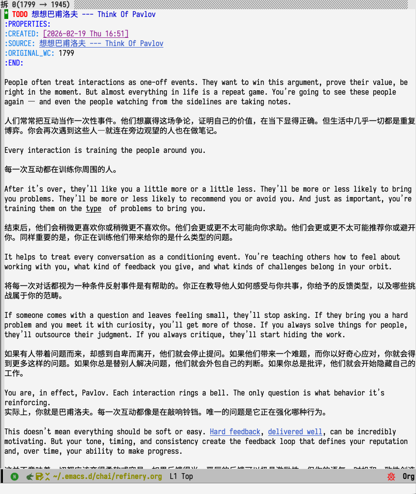

#+TITLE: Chai (拆) - 破坏性阅读与知识消化
#+AUTHOR: Yibie
#+EMAIL: yibie@outlook.com
#+DATE: 2025-01

* Chai (拆)

"拆"——将复杂的知识拆解、消化、重组为自己的理解。

Chai 是一个 Emacs 知识管理工作流，提供两大核心模块：

1. *Library (知识库)* —— 管理阅读材料，支持从 PDF/Markdown/EPUB/HTML 导入
2. *Refinery (拆解工坊)* —— 将内容"分叉"到工作台进行深度加工

#+begin_quote
📖 阅读 → 🔧 拆解 → ✨ 内化
#+end_quote

** 演示

[[file:pics/demo.gif]]

* 安装

** 依赖

- Emacs 29.1+
- [[https://pandoc.org/][Pandoc]] (文件转换)
- Python 3.x + PyMuPDF (PDF 处理)

*** macOS OCR 支持（可选）

#+begin_src bash
pip install pyobjc-framework-Vision Pillow
#+end_src

⚠️ OCR 功能仅在 macOS 上可用，使用 Apple Vision 框架识别扫描版 PDF。

** 配置

#+begin_src elisp
;; 添加到 load-path
(add-to-list 'load-path "~/path/to/chai/")

;; 加载核心模块
(require 'chai)               ;; Refinery 拆解工坊
(require 'chai-library)       ;; Library 知识库
(require 'chai-library-table) ;; Library 表格界面

;; 可选：全局快捷键
(global-set-key (kbd "C-c l") #'chai-library-open)
(global-set-key (kbd "C-c r") #'chai-switch-draft)
#+end_src

** 目录结构

Chai 默认使用以下目录结构（均在 =~/.emacs.d/chai/= 下）：

#+begin_example
~/.emacs.d/chai/
├── library/          ;; 知识库文件
├── inbox/            ;; 待导入文件
├── archive/          ;; 导入后原文件归档
└── refinery.org      ;; 拆解工作台
#+end_example

可通过以下变量自定义：

| 变量 | 说明 | 默认值 |
|------+------+--------|
| =chai-library-directory= | 知识库目录 | =~/.emacs.d/chai/library/= |
| =chai-library-import-inbox= | 导入收件箱 | =~/.emacs.d/chai/inbox/= |
| =chai-library-import-archive= | 归档目录 | =~/.emacs.d/chai/archive/= |
| =chai-refinery-file= | 工作台文件 | =~/.emacs.d/chai/refinery.org= |

* Library (知识库)

** 导入文件

*** 方式 1：Emacs 命令（推荐）

- =M-x chai-library-import= —— 批量导入 inbox 目录中的所有文件
- =C-u M-x chai-library-import= —— 导入单个指定文件

*** 方式 2：命令行

#+begin_src bash
# 批量导入
python convert-to-org.py \
  --temp ~/.emacs.d/chai/inbox/ \
  --reference ~/.emacs.d/chai/library/ \
  --archive ~/.emacs.d/chai/archive/

# 单文件导入
python convert-to-org.py \
  --file ~/Downloads/paper.pdf \
  --reference ~/.emacs.d/chai/library/
#+end_src

*** 支持格式

- PDF（支持扫描版 OCR，仅限 macOS）
- Markdown
- EPUB
- HTML

** 文件名格式

导入后的文件使用结构化命名：

#+begin_example
ID__Author__Title==keyword1_keyword2--status-rating.org
#+end_example

分隔符含义：
- =__= —— 元数据分隔（ID、作者、标题）
- ==== —— 关键词分隔
- =--= —— 状态和评分

** 使用 Library

运行 =M-x chai-library-open= 打开知识库界面（全屏显示）：

[[file:pics/chai-library.png]]

| 按键 | 功能 |
|------+------|
| =RET= | 打开选中的书籍/文档 |
| =s= | 设置阅读状态（unread/reading/done/archived） |
| =r= / =0-5= | 设置评分（0-5 星） |
| =k= | 设置关键词（逗号分隔，编码到文件名中） |
| =a= | 重命名为 Chai 格式（添加 ID） |
| =d= | 删除文件（需确认） |
| =/= | 按标题/作者/关键词过滤 |
| =c= | 清除过滤 |
| =S= | 切换排序方式 |
| =g= | 刷新列表 |

* Refinery (拆解工坊)

** 工作流

#+begin_example
┌─────────────┐      ┌─────────────┐      ┌─────────────┐      ┌─────────────┐
│   源文件     │ ──▶ │   分叉      │ ──▶ │   加工      │ ──▶ │   保存      │
│  (Library)  │      │ (Refinery)  │      │  (压缩/重写) │      │  (永久笔记)  │
└─────────────┘      └─────────────┘      └─────────────┘      └─────────────┘
#+end_example

** 命令

| 命令 | 功能 |
|------+------|
| =M-x chai-refine-heading= | 分叉当前标题到 Refinery |
| =M-x chai-refine-region= | 分叉选中的区域 |
| =M-x chai-switch-draft= | 切换/打开待处理的草稿 |
| =C-c C-c= | 保存为永久笔记 |
| =C-c h= | 纯高亮（无注释） |
| =C-c H= | 高亮 + 注释 |
| =C-c d= | 删除高亮 |
| =C-c x= | 导出高亮（复制/Refinery/笔记） |
| =C-c p= | 切换上下文面板 |
| =C-c C-r= | 刷新注释显示 |

** 压缩进度条

在 Refinery 中编辑时，header-line 会显示实时压缩进度：

#+begin_example
 拆 45% ██████████████████████░░░░░░░░░░░░░░░░░░░░░░░░░░░░
#+end_example

** 高亮系统

在阅读时标记重要内容，共 12 种语义化类型。只要 org 文件中包含 chai 链接，
注释 overlay 会在文件打开时自动渲染，无需手动启用 =chai-mode=。

[[file:pics/chai-annotation.png]]

*** 原有类型

- 🔴 *important* —— 重要观点
- 🟢 *idea* —— 灵感/想法
- 🟠 *question* —— 疑问
- 🟡 *critical* —— 关键内容

*** 扩展类型

- 💛 *key* —— 中心思想/主旨句（黄色高亮）
- 🔴 *core* —— 定义/核心考点（红/橙色高亮）
- 🟢 *detail* —— 数据/关键细节（绿色下划线）
- 🔵 *example* —— 案例/辅助证据（蓝色下划线）
- 🟣 *hard* —— 难点/逻辑转折（紫色波浪线）
- ⬜ *block* —— 完整观点段落（灰色边框）
- 🟪 *view* —— 作者观点/个人心得（紫色）
- ⚫ *outdated* —— 排除/过时信息（删除线）

自定义高亮类型：

#+begin_src elisp
(setq chai-highlight-types
      '(("important" . chai-highlight-important)
        ("idea" . chai-highlight-idea)
        ("key" . chai-highlight-key)
        ;; ... 添加自定义类型
        ("todo" . hl-line)))
#+end_src

** 上下文面板

按 =C-c p= 切换侧边窗口，显示当前 buffer 所有高亮按类型分组。光标所在高亮的类型组会高亮显示，方便定位。

** 保存模式

*** 多文件模式（默认）

每条笔记保存为独立的 Org 文件：

#+begin_src elisp
(setq chai-note-saving-style 'multi-file)
(setq chai-notes-directory "~/notes/chai/")
#+end_src

*** 单文件模式

所有笔记追加到统一的文件中：

#+begin_src elisp
(setq chai-note-saving-style 'single-file)
(setq chai-unified-notes-file "~/notes/chai-notes.org")
#+end_src

* 快速入门

1. *准备材料* —— 将 PDF/EPUB/Markdown 文件放入 inbox 目录
2. *导入* —— 运行 =M-x chai-library-import=
3. *打开 Library* —— =M-x chai-library-open=，按 =RET= 打开文档
4. *拆解* —— 在文档中定位到想摘录的标题，=M-x chai-refine-heading=
5. *加工* —— 在 Refinery 中重写、压缩内容
6. *保存* —— =C-c C-c= 保存为永久笔记

* 链接系统

Chai 使用 =chai:= 链接协议实现知识关联：

- 在 Refinery 中，=SOURCE= 属性自动记录内容来源
- 高亮文本使用 =[[chai:type][text]]= 格式
- 点击高亮可跳转到原文（如果来源是 Library 中的书籍）

* 与其他工具集成

Chai 设计为与现有笔记系统协同工作：

- *Org-roam* —— Refinery 保存的笔记可放入 Org-roam 目录
- *Denote* —— Chai 使用与 Denote 兼容的时间戳 ID
- *Citar/Org-cite* —— 在书籍文件中添加 =#+BIBLIOGRAPHY= 引用

* 贡献

欢迎 Issue 和 PR！

- 代码风格：遵循标准 Emacs Lisp 规范
- 测试：如有新增功能，请在 =test/= 目录添加测试
- 文档：更新此 README 以反映功能变更

* 许可证

GPL-3.0-or-later

* 作者

Yibie <yibie@outlook.com>

* 致谢

- 设计理念受 Zettelkasten 和渐进式总结法启发
- tp.el 提供响应式 UI 支持

* Changelog

** v1.1.0 (2026-02)

- *Library*：新增 =k= 快捷键，用于为书目设置关键词；关键词编码到文件名
  （===kw1_kw2= 段），可通过 =/= 过滤搜索
- *Library*：修复关键词列在更改后不刷新的显示问题
- *Library*：打开时自动全屏（=delete-other-windows=）
- *注释*：包含 chai 链接的任意 org 文件打开时自动渲染注释 overlay，
  无需手动启用 =chai-mode=

** v1.0.0 (2025-01)

- 初始版本发布
- Library 知识库管理
- Refinery 拆解工坊
- 高亮与链接系统（12 种语义化类型）
- 上下文面板（按类型分组显示高亮）
- macOS OCR 支持
